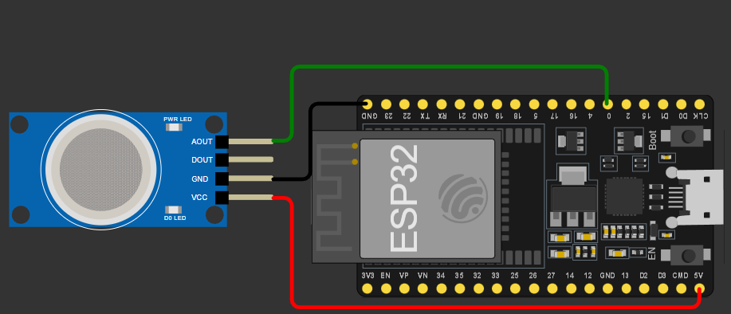
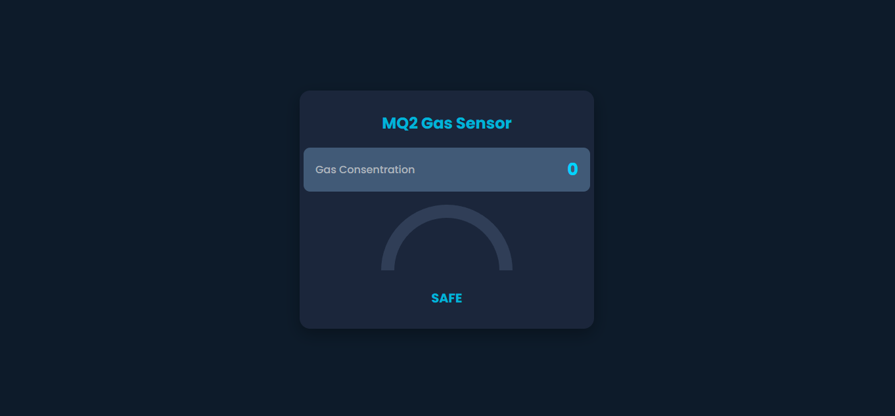

 

# MQ2-IoT-MQTT

This project is a real-time gas monitoring system using the **MQ2 sensor**, an **ESP8266** microcontroller, and the **MQTT** protocol. Data is published to an MQTT broker and displayed on a responsive web dashboard.

## 🔧 Features

- Read gas concentration from the MQ2 sensor
- Publish data over MQTT 
- Real-time monitoring with a responsive web dashboard (HTML + Chart.js)
- Status indicator: SAFE, WARNING, DANGER
- Automatic sound alarm on high gas concentration
- Mobile-friendly layout

## 🧱 Technologies Used

- ESP8266 (Arduino)
- MQTT with `PubSubClient`
- HTML, CSS, JavaScript
- Chart.js for gauge visualization
- MQTT over WebSocket (`mqtt.js`) for dashboard updates

## 🚀 How to Use

### 1. Hardware Required

- ESP8266 board (e.g., NodeMCU or Wemos D1 Mini)
- MQ2 Gas Sensor (LPG/CO/Smoke)
- WiFi connection
- (Optional) Voltage divider for voltage monitoring

## Hardware Schematic

### 2. Flash the Firmware

 - Open the `.ino` file in Arduino IDE
 - Select the correct board type (e.g., "NodeMCU 1.0")
 - Select the detected COM port (e.g., "COM1")
 - Upload the code to the ESP8266

### 3. Setup MQTT Broker

- Use your own MQTT broker or a public one
- Ensure it supports WebSocket on port 9001 for the web dashboard

### 4. Launch the Dashboard

- Open the `index.html` file in a browser
- The dashboard will auto-connect to the MQTT broker and display real-time gas and voltage data

## Website Preview

## 📄 License

This project is licensed under the [MIT License](LICENSE).

## 👤 Author

**Satria Yudha Purnomo**  
[GitHub](https://github.com/IotTechId) • [LinkedIn](https://www.linkedin.com/in/satria-yudha-77344435b/) • [Email](mailto:satriadiwan80@gmail.com)

